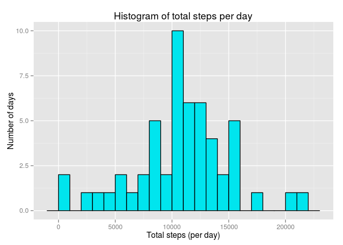
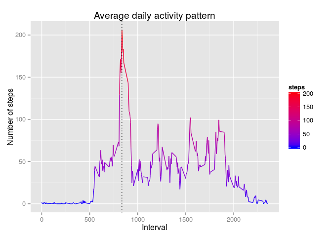

# Reproducible Research: Peer Assessment 1

&nbsp;

### Global options
We first need to load the libraries required for the work and set some global options.


```r
library(knitr)
library(dplyr)
library(ggplot2)
opts_chunk$set(echo = TRUE)
options(scipen=1, digits=2)
```

&nbsp;

## Loading and preprocessing the data


```r
activitydata <- read.csv("activity.csv")
activitydata$date <- as.Date(activitydata$date, "%Y-%m-%d")
activitynona <- filter(activitydata, !is.na(steps))
```

&nbsp;

## What is mean total number of steps taken per day?


```r
dailystepssummary <- summarise(group_by(activitynona, date), dailysteps = sum(steps))
dailyhist <- ggplot(dailystepssummary, aes(x=dailysteps))
dailyhist + 
    geom_histogram(col="black", fill="turquoise2", binwidth = 1000) + 
    labs(title="Histogram of total steps per day", x="Total steps (per day)", y="Number of days")
```

 


```r
meandailysteps <- mean(dailystepssummary$dailysteps)
mediandailysteps <- median(dailystepssummary$dailysteps)
```

The mean for the total number of steps per day is 10766.19 and the median is
10765.


&nbsp;

## What is the average daily activity pattern?


```r
intervalstepssummary <- summarise(group_by(activitynona, interval), steps = mean(steps))
maxactivity <- intervalstepssummary[which.max(intervalstepssummary$steps), 1][[1]]
intervalsts <- ggplot(intervalstepssummary, aes(x = interval, y = steps))
intervalsts + 
    geom_line(aes(colour = steps)) + 
    scale_colour_gradient(low="blue", high="red") + 
    labs(title="Average daily activity pattern", x="Interval", y="Number of steps") + 
    geom_vline(xintercept = maxactivity, linetype = "dotted")
```

 

Interval 835, on average, contains the maximum number of steps throughout the day.


&nbsp;

## Imputing missing values


&nbsp;

## Are there differences in activity patterns between weekdays and weekends?
